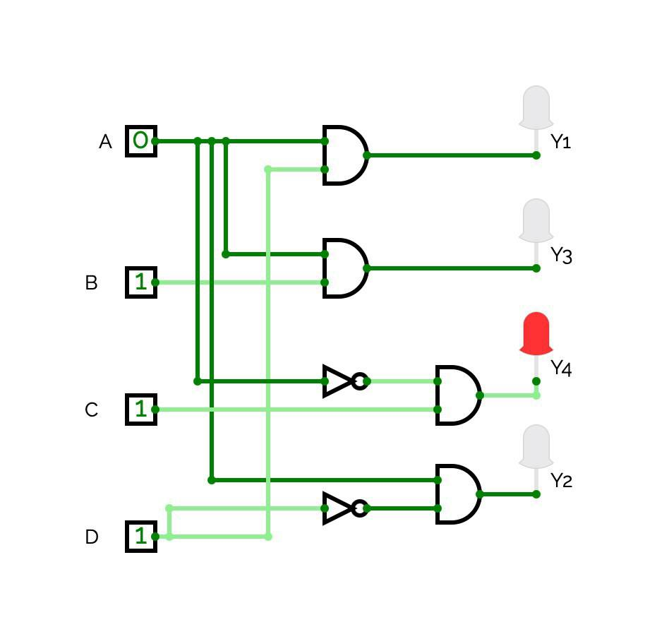
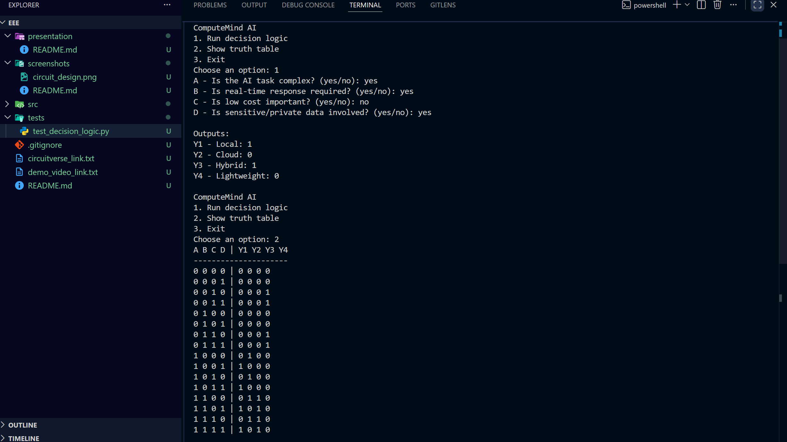

# ComputeMind AI

Decision System for AI Compute Execution

## Project Information

Course: EEE120 Digital Design Fundamentals

Group: 11

Teacher: Rajan Tripathi

## Group Members

| Name | Role |
| --- | --- |
| Babur Turguniy | Presentation and Documentation |
| Suleymanova Liliana | CircuitVerse Designer |
| Georgiy Shatskiy | Python Developer and GitHub Repository |
| Qobiljon Jahongirov | Logic Designer |


## Problem Statement

Modern AI systems often need to decide where an AI task should run. Running a task locally can be faster and more private, but local devices may not have enough power for complex workloads. Cloud execution gives more computing power, but it can cost more and may create privacy concerns. Hybrid execution combines both approaches.

This project models that decision using digital logic and a matching Python prototype.

## Inputs

| Symbol | Input | Meaning |
| --- | --- | --- |
| A | Complexity | `1` means the AI task is complex |
| B | Real-time | `1` means fast response is required |
| C | Cost | `1` means low cost is important |
| D | Privacy | `1` means private data is involved |

## Outputs

| Symbol | Output | Meaning |
| --- | --- | --- |
| Y1 | Local | Run the AI task on the local device |
| Y2 | Cloud | Run the AI task in the cloud |
| Y3 | Hybrid | Combine local and cloud processing |
| Y4 | Lightweight | Use a simple low-cost approach |

## Digital Logic Explanation

The system uses Boolean logic gates to activate outputs based on the input conditions.

`Y1 = A AND D`

`Y2 = A AND NOT D`

`Y3 = A AND B`

`Y4 = NOT A AND C`

The same formulas are used in both the CircuitVerse circuit and the Python program.

## Truth Table

| A | B | C | D | Y1 Local | Y2 Cloud | Y3 Hybrid | Y4 Lightweight |
| --- | --- | --- | --- | --- | --- | --- | --- |
| 0 | 0 | 0 | 0 | 0 | 0 | 0 | 0 |
| 0 | 0 | 0 | 1 | 0 | 0 | 0 | 0 |
| 0 | 0 | 1 | 0 | 0 | 0 | 0 | 1 |
| 0 | 0 | 1 | 1 | 0 | 0 | 0 | 1 |
| 0 | 1 | 0 | 0 | 0 | 0 | 0 | 0 |
| 0 | 1 | 0 | 1 | 0 | 0 | 0 | 0 |
| 0 | 1 | 1 | 0 | 0 | 0 | 0 | 1 |
| 0 | 1 | 1 | 1 | 0 | 0 | 0 | 1 |
| 1 | 0 | 0 | 0 | 0 | 1 | 0 | 0 |
| 1 | 0 | 0 | 1 | 1 | 0 | 0 | 0 |
| 1 | 0 | 1 | 0 | 0 | 1 | 0 | 0 |
| 1 | 0 | 1 | 1 | 1 | 0 | 0 | 0 |
| 1 | 1 | 0 | 0 | 0 | 1 | 1 | 0 |
| 1 | 1 | 0 | 1 | 1 | 0 | 1 | 0 |
| 1 | 1 | 1 | 0 | 0 | 1 | 1 | 0 |
| 1 | 1 | 1 | 1 | 1 | 0 | 1 | 0 |

## Python Program Explanation

The Python program asks the user four yes/no questions. Each answer is converted into a Boolean value. The program then applies the same Boolean formulas used in the circuit and prints the values of Y1, Y2, Y3, and Y4.

The implementation is located in `src/`.

## Project Structure

| Path | Description |
| --- | --- |
| `src/main.py` | Console interface for user input and output display |
| `src/decision_logic.py` | Boolean logic implementation matching the circuit |
| `tests/test_decision_logic.py` | Unit tests for formulas, truth table, and input parsing |
| `screenshots/` | CircuitVerse and Python output screenshots |
| `presentation/` | Final project presentation PDF |

## How to Run the Python Code

From the project root:

```bash
python src/main.py
```

To run tests:

```bash
python -m unittest discover tests
```

## Screenshots

Circuit design:



Python output:



## AI/LLM Usage

AI tools were used to help structure the project, explain Boolean logic, prepare README text, and check the Python implementation with tests. The final code and logic were reviewed and understood by the group.

## Future Improvements

- Add a simple graphical interface.
- Add more detailed scoring for cost, performance, and privacy.
- Connect the logic to a real AI workload selection system.
- Add a short demo video.
